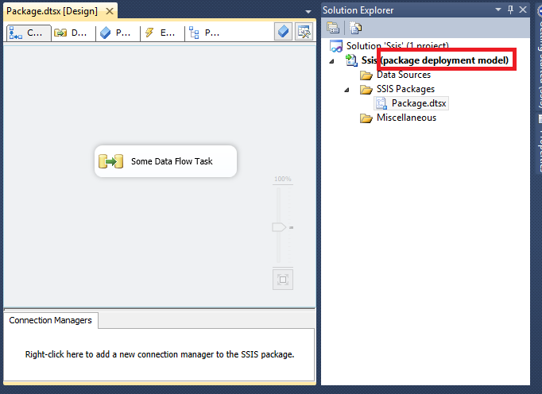
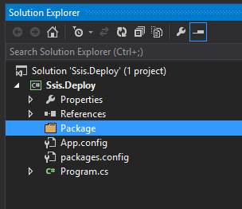
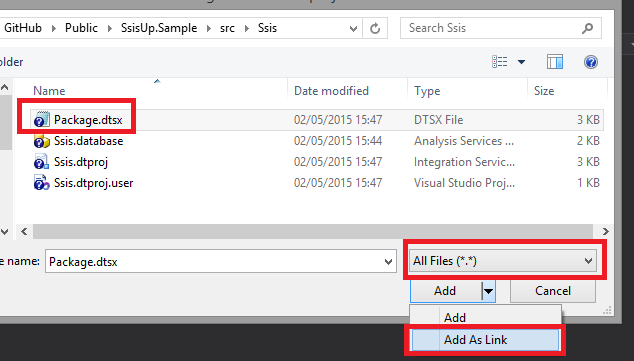
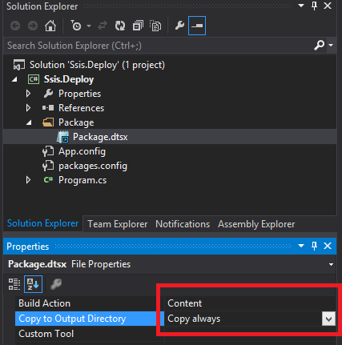
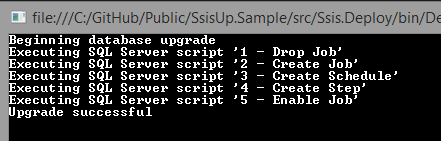
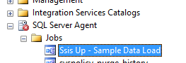

| Build | Downloads | Version |
|-------|-----------|---------|
| [](https://ci.appveyor.com/project/jsm85/ssisup) |  |  |


SsisUp is a .Net library that will help you to deploy MS SQL Server Integration Services Packages. It will also create jobs on MS SQL Server.

# Use Case

I built this library in order to automate the deployment of an MS SQL Server Integration Services package / job using [Octopus Deploy](http://octopusdeploy.com/). We can now deploy our Web Application, Windows Services, Database Upgrade (using [DbUp](http://dbup.github.io/)) and SSIS package to Dev, QA and Live without any manual intevention.    

# Main Features

* Create an MS SQL Server Job Schedule that can occur on any day(s) of the week at any time 
* 3 Job Steps Types are supported (Integration Services, SQL Script and CMD)
* Enable or Diasble the step on deployment
* Configure a SQL Proxy for the Job step
* Configure a Dtsx Configuration file
* Dtsx and DtsConfig files are deployed to destination (Write access is required on Destination)
* Define Job step success or failure action


# Getting Started

Start by creating a MS SQL Server Integration Services (SSIS) package using SQL Server Data Tools. This sample will use just have an empty Data Flow Task (This tutorial will only focus on deploying an SSIS package).



**PLEASE NOTE:** SsisUp only supports package deployment model project types

Now, in the same directory you created the project above, open Visual Studio 2013 and create a new Console Application. Once created, install the SsisUp Nuget; Run the following command in the Package Manager Console:

`Install-Package SsisUp`

Next, create a folder in the project called Package, this is where we will reference the package created at the beginning of tutorial.



Now, right click on the Package, hover over Add and then click on Existing Item… Navigate to where the dtsx file is located and click Add As Link.



Mark the file as Content type and Copy always in the properties window.



In the App.config file, copy this code below:

``` xml
<?xml version="1.0" encoding="utf-8" ?>
<configuration>
  <appSettings>
    <add key="FileDestination" value="C:\SamplePackages\"/>
  </appSettings>
  <connectionStrings>
    <add name="MasterDb" connectionString="data source=localhost;database=Master;Integrated Security=true;"/>
  </connectionStrings>
    <startup> 
        <supportedRuntime version="v4.0" sku=".NETFramework,Version=v4.5" />
    </startup>
</configuration>
```

In the Program.cs file, copy this code below:

``` csharp
using System;
using System.Configuration;
using SsisUp.Builders;
using SsisUp.Builders.References;

namespace Ssis.Deploy
{
    public class Program
    {
        public static int Main(string[] args)
        {
            var connectionString = ConfigurationManager.ConnectionStrings["MasterDb"];
            var fileDestination = ConfigurationManager.AppSettings["FileDestination"];

            var jobConfiguration = JobConfiguration.Create()
                .WithName("Ssis Up - Sample Data Load")
                .WithDescription("This is a sample data load")
                .WithSsisOwner("sa")
                .WithSsisServer(Environment.MachineName)
                .WithSchedule(
                    ScheduleConfiguration.Create()
                        .WithName("Saturday Load")
                        .RunOn(FrequencyDay.Saturday)
                        .StartingAt(new TimeSpan(10, 0, 0))
                        .ActivatedFrom(DateTime.Parse("1 Jan 2010"))
                        .ActivatedUntil(DateTime.Parse("31 Dec 2020")))
                .WithStep(
                    StepConfiguration.Create()
                        .WithId(1)
                        .WithName("Sample Package")
                        .WithSubSystem(SsisSubSystem.IntegrationServices)
                        .WithDtsxFile(@".\Packages\Package.dtsx")
                        .WithDtsxFileDestination(fileDestination)
                        .ExecuteCommand(
                            string.Format(
                                @"/FILE ""{0}\Package.dtsx"" /CHECKPOINTING OFF /REPORTING E /X86",
                                fileDestination))
                        .OnSuccess(JobAction.QuitWithSuccess)
                        .OnFailure(JobAction.QuitWithFailure));


            var result = DeploymentConfiguration
                .Create()
                .ToDatabase(connectionString.ConnectionString)
                .WithJobConfiguration(jobConfiguration)
                .Deploy();

            if (!result.Successful)
            {
                return -1;
            }

            return 0;
        }
    }
}

```

The code above will configure a job in MS SQL Server with one step and one schedule. Hit F5 and you should see the following output:



**PLEASE NOTE:** Write access to Master database is required in order to deploy the job.
**PLEASE NOTE:** Every time the application runs it will drop and re-create the job.

If you now open up MS SQL Server Management Studio you will see the job has been created with all the right configuration settings



# Deploy using Octopus Deploy

Coming soon

# Contributing

I happily welcome any help with this project. As mentioned in the use case, this library was built for a specific case. If you have any other use cases, raise an Issue and send me a Pull Request

Happy Deploying :)

**KEEP CALM AND AUTOMATE**
